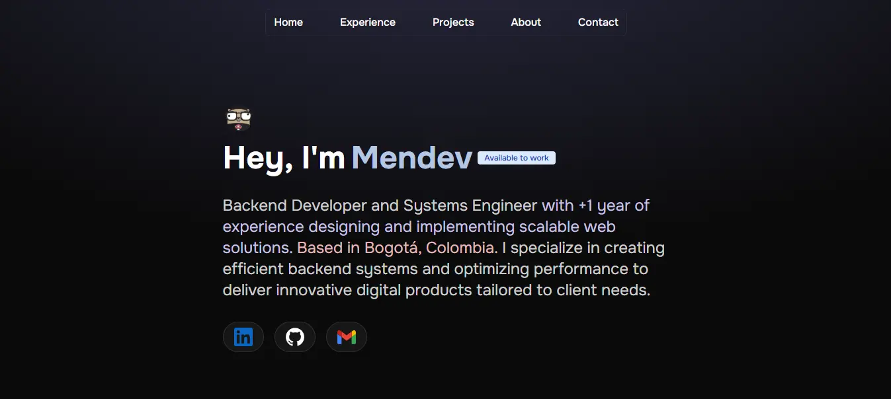

# Mendev Portfolio

Bienvenido al repositorio de **Mendev**, mi portafolio profesional desarrollado con **Astro**. Este proyecto presenta mis habilidades, experiencia y proyectos destacados en un diseño moderno y eficiente.



## 🌟 Características

- **Desarrollo con Astro**: Aprovecha la rapidez y simplicidad de Astro para sitios web estáticos.
- **Componentización**: Uso de componentes reutilizables para mejorar la mantenibilidad del código.
- **Optimización de rendimiento**: Carga rápida y eficiente para una mejor experiencia de usuario.
- **Estilos modernos**: Diseño atractivo con Tailwind CSS.
- **Sección de proyectos**: Muestra mis principales trabajos con enlaces y descripciones detalladas.
- **Adaptabilidad**: Diseño responsivo para una óptima visualización en distintos dispositivos.
- **Formulario de contacto con Formspree**: Permite enviar mensajes de manera sencilla.

## 🚀 Instalación y Uso

Sigue estos pasos para clonar y ejecutar el proyecto en tu entorno local:

### 1️⃣ Clonar el Repositorio

```sh
 git clone https://github.com/AndresMGdev/mendev.git
 cd mendev
```

### 2️⃣ Instalar Dependencias

```sh
 npm install
```

### 3️⃣ Ejecutar en Modo Desarrollo

```sh
 npm run dev
```

*El servidor iniciará en* `http://localhost:4321`

### 4️⃣ Construcción para Producción

```sh
 npm run build
```

*Generará los archivos optimizados en la carpeta **`dist/`**.*

### 5️⃣ Vista Previa de la Construcción

```sh
 npm run preview
```

## 📂 Estructura del Proyecto

```text
/
├── public/ (Imágenes y archivos estáticos)
├── src/
│   ├── components/ (Componentes reutilizables)│       
|   |   ├── icons/ (Icons reutilizables)
│   |   ├── Contact.astro (Sección de contacto/formulario)
│   |   ├── Hero.astro (Sección principal de presentación)
│   |   ├── About.astro (Sección de información sobre mí)
│   ├── layouts/ (Plantillas de diseño)
│   ├── pages/ (Páginas principales)
│   └── data/
│       ├── projects.js (Listado de proyectos)
│       ├── tags.js (Etiquetas para clasificar tecnologías)
│       └── experience.js (Experiencia laboral)
│
└── package.json (Configuración del proyecto)
```

## 📌 Tecnologías Utilizadas

- **Astro** - Framework principal
- **Tailwind CSS** - Estilización moderna y eficiente
- **JavaScript** - Lógica e interactividad
- **Markdown** - Creación de contenido estático
- **Formspree** - Manejo de formularios de contacto

## 📜 Licencia

Este proyecto está bajo la licencia **MIT**. Puedes usarlo, modificarlo y distribuirlo libremente.

## 📞 Contacto

Si tienes preguntas, sugerencias o simplemente quieres conectar conmigo, puedes encontrarme en:

- **LinkedIn**: [Ir](https://www.linkedin.com/in/cmendoza02/)
- **Correo**: [Ir](mailto:cmendoza022002@gmail.com)

---

¡Gracias por visitar mi portafolio! 🚀

